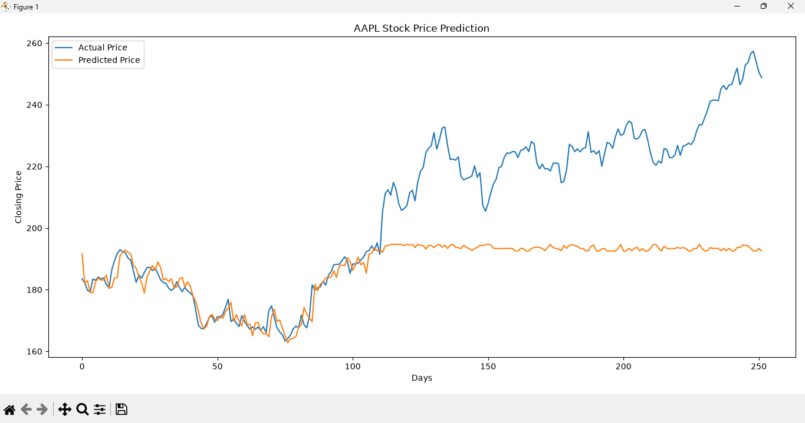

# 📈 Stock Price Prediction Using Machine Learning

<p align="center">


</p>

<h3 align="center">
Predicting Next-Day Stock Closing Prices Using Machine Learning
</h3>

---

## 🚀 Overview

## 📈 Prediction Result


Stock markets generate massive amounts of historical data every day. This project leverages Machine Learning techniques to analyze historical stock trends and predict the next day's closing price.

Using historical stock data obtained from Yahoo Finance, a Random Forest Regressor is trained on key market indicators including Open, High, Low, and Volume values to make short-term stock price predictions.

The project demonstrates the practical application of Machine Learning in financial forecasting and predictive analytics.

---

## 🎯 Project Objectives

✅ Fetch real-world stock market data

✅ Perform data preprocessing and feature engineering

✅ Predict the next day's closing stock price

✅ Train a Random Forest Regression model

✅ Evaluate prediction performance

✅ Visualize Actual vs Predicted prices

✅ Export prediction results

---

## 📊 Dataset Information

**Data Source:** Yahoo Finance

**Stock Symbol:** AAPL (Apple Inc.)

**Historical Period:**

* Start Date: January 2020
* End Date: January 2025

The dataset includes:

* Open Price
* High Price
* Low Price
* Close Price
* Trading Volume

---

## 🛠 Technologies & Libraries

| Technology    | Usage                    |
| ------------- | ------------------------ |
| Python        | Core Programming         |
| Pandas        | Data Processing          |
| yFinance      | Financial Data Retrieval |
| Scikit-Learn  | Machine Learning         |
| Random Forest | Regression Model         |
| Matplotlib    | Data Visualization       |

---

## ⚙️ Machine Learning Pipeline

### 1️⃣ Data Collection

Historical stock data is downloaded directly from Yahoo Finance.

### 2️⃣ Data Preparation

Missing values are removed and the next-day closing price is created as the target variable.

### 3️⃣ Feature Selection

The model uses:

* Open
* High
* Low
* Volume

### 4️⃣ Model Training

A Random Forest Regressor is trained on historical stock data.

### 5️⃣ Prediction

The trained model predicts the next day's stock closing price.

### 6️⃣ Performance Evaluation

The model is evaluated using:

* Mean Absolute Error (MAE)
* R² Score

### 7️⃣ Visualization

Actual and predicted stock prices are compared using graphical plots.

---

## 📈 Model Performance Metrics

The following metrics are used to evaluate model accuracy:

### Mean Absolute Error (MAE)

Measures the average prediction error.

### R² Score

Measures how well the model explains stock price variations.

Higher R² values indicate better predictive performance.

---

## 📷 Project Output

The project generates:

* Predicted stock prices
* Performance metrics
* Actual vs Predicted comparison graph
* CSV export of predictions

---

## 📁 Project Structure

```text
Stock-Price-Prediction/
│
├── Stock_Prediction.py
├── Predicted_Stock_Prices.csv
├── graph.png
├── LICENSE
└── README.md
```

---

## 🚀 Installation

Install all required libraries:

```bash
pip install yfinance pandas matplotlib scikit-learn
```

Run the project:

```bash
python Stock_Prediction.py
```

---

## ✨ Key Features

✔ Real-Time Financial Data Retrieval

✔ Machine Learning-Based Forecasting

✔ Automated Prediction Pipeline

✔ Performance Evaluation Metrics

✔ Graphical Visualization

✔ CSV Prediction Export

✔ Beginner-Friendly Implementation

✔ Portfolio-Ready Project

---

## 🔮 Future Enhancements

* Multiple Stock Prediction Support
* LSTM Deep Learning Models
* Real-Time Dashboard Integration
* Hyperparameter Optimization
* Interactive Web Application using Streamlit

---

## 👩‍💻 Author

### Nouman Majeed

---

## ⭐ Show Your Support

If you found this project helpful, consider giving it a ⭐ on GitHub.

It motivates continuous learning and future project development.

---

